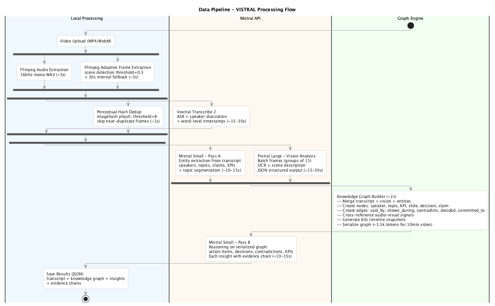

<p align="center">
  
</p>

<h1 align="center">Vistral</h1>

<p align="center">
  <strong>Temporal Knowledge Graphs from videos — with traceable evidence chains.</strong>
</p>

<p align="center">
  Built entirely on the Mistral AI stack: Voxtral (ASR) + Pixtral (Vision) + Mistral Small (Reasoning)
</p>

---

## What is Vistral?

Vistral turns any video (meetings, interviews, podcasts) into a **Temporal Knowledge Graph** — a structured, queryable representation of everything that was said, shown, and decided, with every insight linked to an exact timestamp and source.

Unlike traditional video summarizers that output flat bullet points, Vistral preserves **temporal relationships** and **cross-modal signals**: it can detect when a speaker's claim contradicts what's on a slide, track how topics evolve across speakers, and link every action item back to the exact moment it was assigned.

### Key capabilities

- **Automatic speaker diarization** — identifies who said what, with talk-time stats
- **Topic segmentation** — breaks the video into thematic arcs with time ranges
- **Action items & decisions** — extracted with assignee, priority, and evidence chains
- **Contradiction detection** — flags discrepancies between audio claims and visual content
- **KPI extraction** — pulls out quantitative metrics with context
- **Interactive timeline** — click any event to jump to the exact video moment
- **Force-directed knowledge graph** — explore entities and relationships visually
- **Key quotes** — highlights impactful statements with speaker attribution

## How it works

Vistral runs an **8-stage pipeline** with 3 parallelism windows, processing a 10-minute video in ~2 minutes:

```
Video Upload
    │
    ├── Audio Extraction (FFmpeg)
    └── Frame Extraction (FFmpeg scene detection)
            │
            ├── Voxtral ASR (transcription + speaker diarization)
            ├── Frame Deduplication (perceptual hashing, 70%+ cost reduction)
            ├── Pass A: Entity Extraction (Mistral Small on transcript)
            └── Pixtral Vision Analysis (OCR, scene understanding)
                    │
                    └── Knowledge Graph Construction
                            │
                            └── Pass B: Insight Reasoning (Mistral Small on graph)
```

**Two-pass LLM architecture:**
- **Pass A** (Perception): Extracts entities from the raw transcript — speakers, topics, claims, KPIs
- The pipeline builds a compact **Temporal Knowledge Graph** (~3.5k tokens vs ~40k for raw transcript — **91% token reduction**)
- **Pass B** (Reasoning): Reasons over the serialized graph to produce insights with evidence chains

<p align="center">
  
</p>

## Getting started

### Prerequisites

- **Python 3.11+**
- **Node.js 18+**
- **FFmpeg** — for audio/frame extraction
- **yt-dlp** (optional) — for YouTube URL support
- **Mistral API key** — get one at [console.mistral.ai](https://console.mistral.ai)

#### Install system dependencies

```bash
# macOS
brew install ffmpeg yt-dlp

# Ubuntu/Debian
sudo apt install ffmpeg
pip install yt-dlp
```

### Installation

```bash
git clone https://github.com/DonTizi/vistral.git
cd vistral
```

**Backend:**

```bash
cd backend
python -m venv .venv
source .venv/bin/activate
pip install -r requirements.txt
```

**Frontend:**

```bash
cd frontend
npm install
```

### Configuration

Create a `.env` file in the project root:

```env
MISTRAL_API_KEY=your_api_key_here
```

Or set it through the in-app settings modal (gear icon in the sidebar).

### Running

```bash
# Terminal 1 — Backend (port 8000)
cd backend
source .venv/bin/activate
uvicorn backend.main:app --reload --port 8000

# Terminal 2 — Frontend (port 3000)
cd frontend
npm run dev
```

Open [http://localhost:3000](http://localhost:3000).

### Try the demos

Vistral ships with **2 pre-computed demo analyses** that work without an API key:

- **AI Agent Deployment Challenges** — Arthur Mensch on enterprise AI, SaaS replacement, and agentic workflows
- **Mistral AI — $2B Funding Round** — CNBC interview with Arthur Mensch on funding, talent, and competition

Click any demo card on the landing page to explore the full analysis dashboard.

## Tech stack

| Layer | Technology |
|-------|-----------|
| Frontend | Next.js 16, React 19, TailwindCSS 4, react-force-graph-2d |
| Backend | Python, FastAPI, uvicorn |
| ASR | Voxtral Mini — speech-to-text with speaker diarization |
| Vision | Pixtral 12B — OCR, scene understanding, slide detection |
| Reasoning | Mistral Small — entity extraction and insight reasoning |
| Media | FFmpeg (audio/frames), imagehash (perceptual dedup) |
| Real-time | Server-Sent Events for live pipeline progress |

## Project structure

```
vistral/
├── backend/
│   ├── main.py                  # FastAPI entry point
│   ├── config.py                # Environment config & constants
│   ├── models.py                # Shared data models (graph, transcript, insights)
│   ├── pipeline/
│   │   ├── orchestrator.py      # Pipeline coordinator with SSE progress
│   │   ├── audio_extractor.py   # FFmpeg audio extraction
│   │   ├── frame_extractor.py   # Scene detection + frame extraction
│   │   ├── frame_dedup.py       # Perceptual hash deduplication
│   │   ├── transcriber.py       # Voxtral ASR + diarization
│   │   ├── vision_analyzer.py   # Pixtral batched vision analysis
│   │   ├── graph_builder.py     # Knowledge graph construction
│   │   └── reasoner.py          # Two-pass LLM reasoning
│   ├── prompts/                 # LLM prompt templates
│   └── routers/                 # API endpoints (upload, jobs, demo, settings)
├── frontend/
│   ├── src/app/
│   │   ├── page.tsx             # Landing page (upload + demos)
│   │   ├── processing/          # Real-time progress page
│   │   └── analysis/            # Analysis dashboard (8-tab UI)
│   ├── src/components/          # Sidebar, YouTubePlayer, UI primitives
│   ├── src/hooks/               # useSSE, useVideoSync
│   └── src/lib/                 # API client, types, utils
├── precompute/demos/            # Pre-computed demo analyses (JSON)
└── docs/
    ├── architecture/            # C4 diagrams (PlantUML + rendered images)
    └── adr/                     # Architecture Decision Records
```

## API

| Method | Endpoint | Description |
|--------|----------|-------------|
| `POST` | `/api/upload` | Upload video file (MP4, WebM, MOV — max 500MB) |
| `POST` | `/api/upload-url` | Process a YouTube URL |
| `GET` | `/api/jobs` | List all completed analyses |
| `GET` | `/api/jobs/{id}/stream` | SSE stream of pipeline progress |
| `GET` | `/api/jobs/{id}/results` | Complete analysis results (JSON) |
| `GET` | `/api/jobs/{id}/video` | Serve uploaded video with Range support |
| `GET` | `/api/demo/{name}` | Pre-computed demo results |
| `PUT` | `/api/settings/api-key` | Update Mistral API key |
| `DELETE` | `/api/data` | Purge all jobs and uploads |
| `GET` | `/api/health` | Health check |

## Configuration

Key settings in `backend/config.py`:

| Setting | Default | Description |
|---------|---------|-------------|
| `MISTRAL_API_KEY` | env var | Required for live processing |
| `MODEL_ASR` | `voxtral-mini-latest` | Speech-to-text model |
| `MODEL_VISION` | `pixtral-large-latest` | Vision/OCR model |
| `MODEL_REASONING` | `mistral-small-latest` | Reasoning model |
| `MAX_FRAMES_PER_BATCH` | 15 | Frames per Pixtral API call |
| `PHASH_THRESHOLD` | 8 | Hamming distance for frame dedup |
| `SCENE_DETECT_THRESHOLD` | 0.3 | FFmpeg scene detection sensitivity |
| `MAX_UPLOAD_SIZE_MB` | 500 | Maximum upload file size |

## Architecture decisions

Documented in [`docs/adr/`](docs/adr/):

| ADR | Decision |
|-----|----------|
| [001](docs/adr/001-temporal-knowledge-graph-over-flat-transcript.md) | Temporal Knowledge Graph over flat transcript |
| [002](docs/adr/002-two-pass-llm-architecture.md) | Two-pass LLM architecture (perception + reasoning) |
| [003](docs/adr/003-mistral-small-over-large.md) | Mistral Small over Large for reasoning |
| [004](docs/adr/004-sse-for-realtime-progress.md) | Server-Sent Events for real-time progress |
| [005](docs/adr/005-json-files-over-database.md) | JSON file storage over database |

## License

MIT
