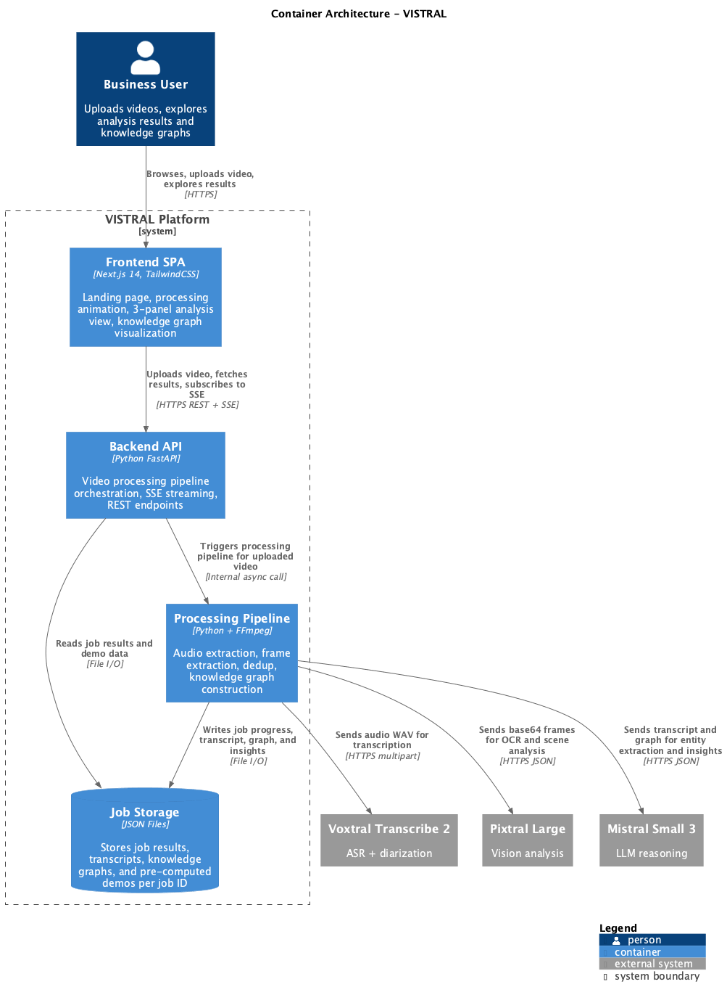

# VISTRAL

**Video Intelligence via Spatial-Temporal Reasoning and Analysis by Mistral**

VISTRAL extracts traceable, multimodal insights from enterprise videos, meetings, interviews, podcasts by building a **Temporal Knowledge Graph** from audio transcription and visual analysis. Every insight is backed by timestamped evidence chains linking back to what was said and what was shown on screen.

Built entirely on the **Mistral AI stack**: Voxtral for speech-to-text, Pixtral for vision/OCR, and Mistral Small for reasoning.

<p align="center">
  
</p>

## Key Features

- **Temporal Knowledge Graph** — Structured graph with 6 node types (speakers, topics, claims, KPIs, slides, decisions) and 7 relation types, enabling rich querying and native contradiction detection
- **Multimodal Contradiction Detection** — Automatically flags discrepancies between what speakers say and what slides show (e.g., "18% growth" spoken vs "8% growth" on a slide)
- **Two-Pass LLM Architecture** — Pass A extracts entities from transcript; Pass B reasons over the serialized graph (3.5k tokens) instead of raw transcript (40k tokens), achieving 91% token reduction
- **Evidence Chains** — Every action item, decision, KPI, and contradiction links to exact timestamps, quotes, and visual evidence
- **Adaptive Frame Extraction** — FFmpeg scene detection + perceptual hash dedup reduces vision API costs by 70%+
- **Interactive Timeline** — Click any topic, speaker segment, or event marker to seek the video instantly
- **Force-Directed Graph Visualization** — Explore the knowledge graph with color-coded nodes and clickable navigation
- **Real-Time Processing** — SSE-powered progress tracking across 6 pipeline stages

## Architecture

The processing pipeline runs in 5 stages with 3 parallelism windows:

```
1. Audio Extraction ─┐
                     ├─ parallel
2. Frame Extraction ─┘
                        3. Voxtral ASR ────────┐
                        4. Frame Dedup          ├─ parallel
                        5. Pass A (Entities) ───┤
                        6. Pixtral Vision ──────┘
                                                   7. Graph Construction
                                                   8. Pass B (Insights)
```

<p align="center">
  
</p>

## Tech Stack

| Layer | Technology |
|-------|-----------|
| Frontend | Next.js 16, React 19, TailwindCSS 4, Framer Motion, react-force-graph-2d |
| Backend | Python, FastAPI, uvicorn, httpx |
| Speech-to-Text | Voxtral Mini (diarized transcription) |
| Vision/OCR | Pixtral Large (scene understanding, slide OCR) |
| Reasoning | Mistral Small (entity extraction, insight generation) |
| Media Processing | FFmpeg (audio/frame extraction, scene detection) |
| Frame Dedup | Pillow + imagehash (perceptual hashing) |

## Getting Started

### Prerequisites

- Python 3.11+
- Node.js 20+
- FFmpeg installed and in PATH
- Mistral API key

### Backend

```bash
cd backend
python -m venv .venv
source .venv/bin/activate
pip install -r requirements.txt

export MISTRAL_API_KEY="your-key-here"
uvicorn backend.main:app --reload --port 8000
```

### Frontend

```bash
cd frontend
npm install
npm run dev
```

The app will be available at `http://localhost:3000`.

### Try the Demos

VISTRAL ships with 3 pre-computed demos that work without a Mistral API key:

- **Meeting** — Q3 budget review with slides, 3 speakers, contradiction detection
- **Interview** — Senior engineer candidate assessment
- **Podcast** — AI industry trends with expert panel

Click any demo card on the landing page to explore the full analysis UI.

## API Endpoints

| Method | Endpoint | Description |
|--------|----------|-------------|
| `POST` | `/api/upload` | Upload a video file (MP4/WebM/MOV, max 500MB) |
| `GET` | `/api/jobs/{id}/stream` | SSE stream of pipeline progress events |
| `GET` | `/api/jobs/{id}/results` | Complete analysis results (JSON) |
| `GET` | `/api/jobs/{id}/video` | Serve uploaded video with Range support |
| `GET` | `/api/demo/{name}` | Pre-computed demo results (meeting/interview/podcast) |
| `GET` | `/api/health` | Health check |

## Project Structure

```
vistral/
├── backend/
│   ├── main.py                  # FastAPI entry point
│   ├── config.py                # Configuration and constants
│   ├── models.py                # Data models (graph, transcript, insights)
│   ├── pipeline/
│   │   ├── orchestrator.py      # Pipeline coordinator with SSE events
│   │   ├── audio_extractor.py   # FFmpeg audio extraction
│   │   ├── frame_extractor.py   # FFmpeg scene-based frame extraction
│   │   ├── frame_dedup.py       # Perceptual hash deduplication
│   │   ├── transcriber.py       # Voxtral ASR with diarization
│   │   ├── vision_analyzer.py   # Pixtral vision analysis
│   │   ├── graph_builder.py     # Temporal Knowledge Graph construction
│   │   └── reasoner.py          # Two-pass LLM reasoning (Pass A + B)
│   ├── prompts/                 # LLM prompt templates
│   └── routers/                 # FastAPI route handlers
├── frontend/
│   └── src/
│       ├── app/                 # Next.js pages (landing, processing, analysis)
│       ├── components/          # UI components (Badge, Card, ProgressBar, logos)
│       ├── hooks/               # useSSE, useVideoSync
│       └── lib/                 # API client, types, utilities
├── precompute/demos/            # Pre-computed demo results
└── docs/
    ├── architecture/            # C4 diagrams (PlantUML + rendered PNG/SVG)
    └── adr/                     # Architecture Decision Records
```

## Configuration

Key settings in `backend/config.py`:

| Setting | Default | Description |
|---------|---------|-------------|
| `MISTRAL_API_KEY` | env var | Required for live processing |
| `MODEL_ASR` | `voxtral-mini-latest` | Speech-to-text model |
| `MODEL_VISION` | `pixtral-large-latest` | Vision/OCR model |
| `MODEL_REASONING` | `mistral-small-latest` | Reasoning model |
| `MAX_FRAMES_PER_BATCH` | 15 | Frames per Pixtral API call |
| `PHASH_THRESHOLD` | 8 | Hamming distance for frame dedup |
| `SCENE_DETECT_THRESHOLD` | 0.3 | FFmpeg scene detection sensitivity |
| `MIN_FRAME_INTERVAL` | 30s | Fallback frame extraction interval |
| `MAX_UPLOAD_SIZE_MB` | 500 | Maximum upload file size |

## Architecture Decision Records

| ADR | Decision |
|-----|----------|
| [001](docs/adr/001-temporal-knowledge-graph-over-flat-transcript.md) | Temporal Knowledge Graph over flat transcript |
| [002](docs/adr/002-two-pass-llm-architecture.md) | Two-pass LLM architecture (perception + reasoning) |
| [003](docs/adr/003-mistral-small-over-large.md) | Mistral Small over Large for reasoning |
| [004](docs/adr/004-sse-for-realtime-progress.md) | Server-Sent Events for real-time progress |
| [005](docs/adr/005-json-files-over-database.md) | JSON file storage over database |
| [006](docs/adr/006-adaptive-frame-extraction-with-dedup.md) | Adaptive frame extraction with perceptual hash dedup |

## License

This project was built for the Mistral AI Hackathon.
