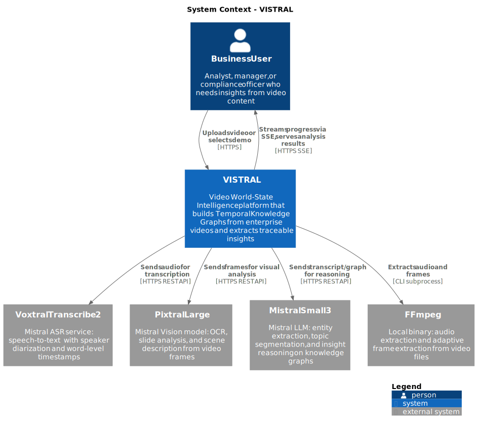
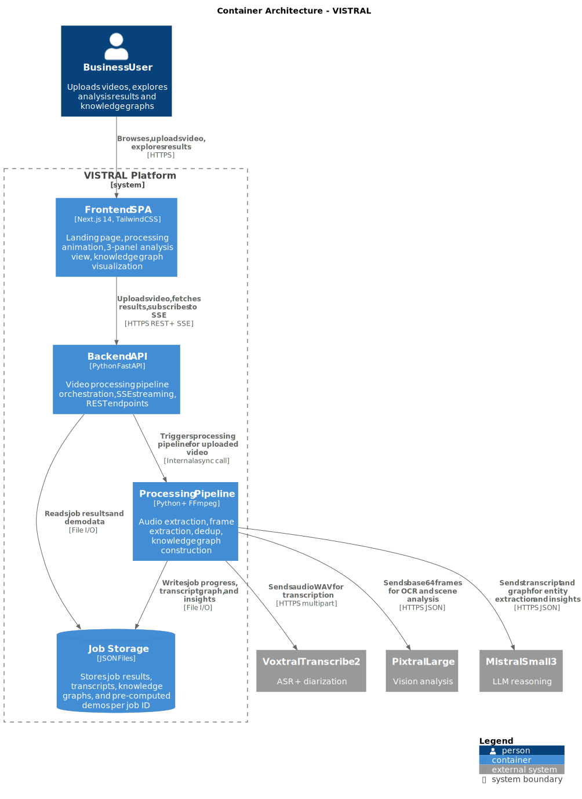
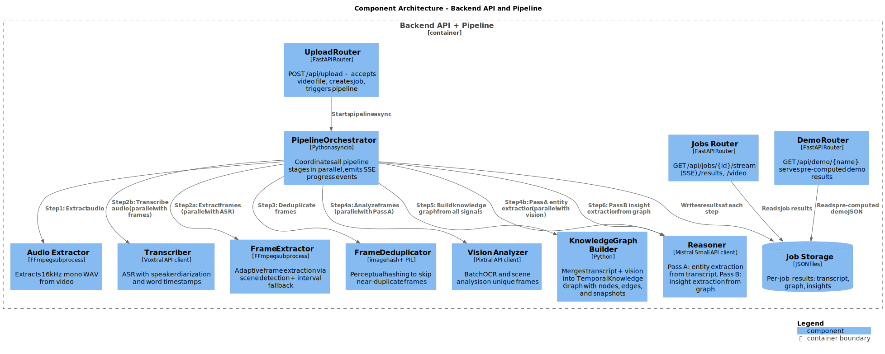
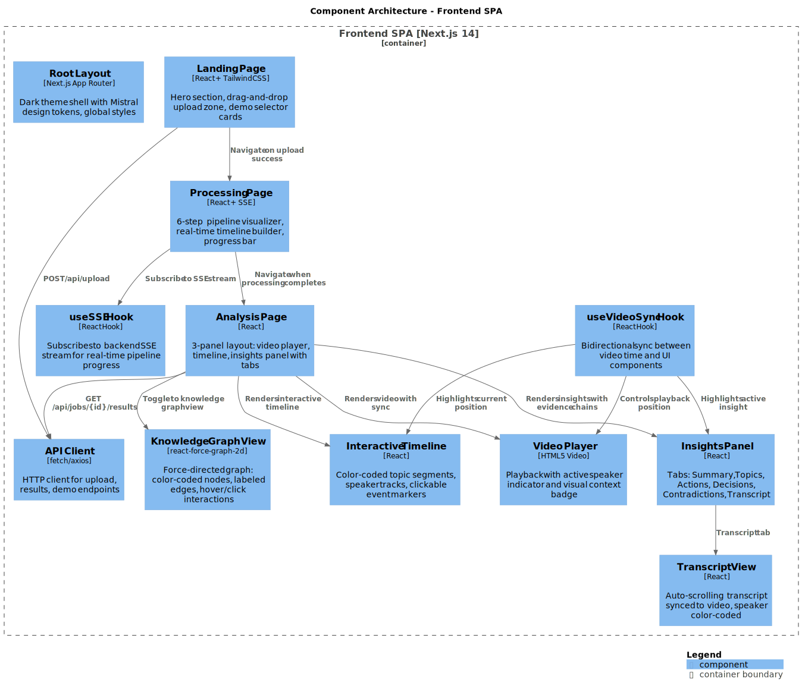
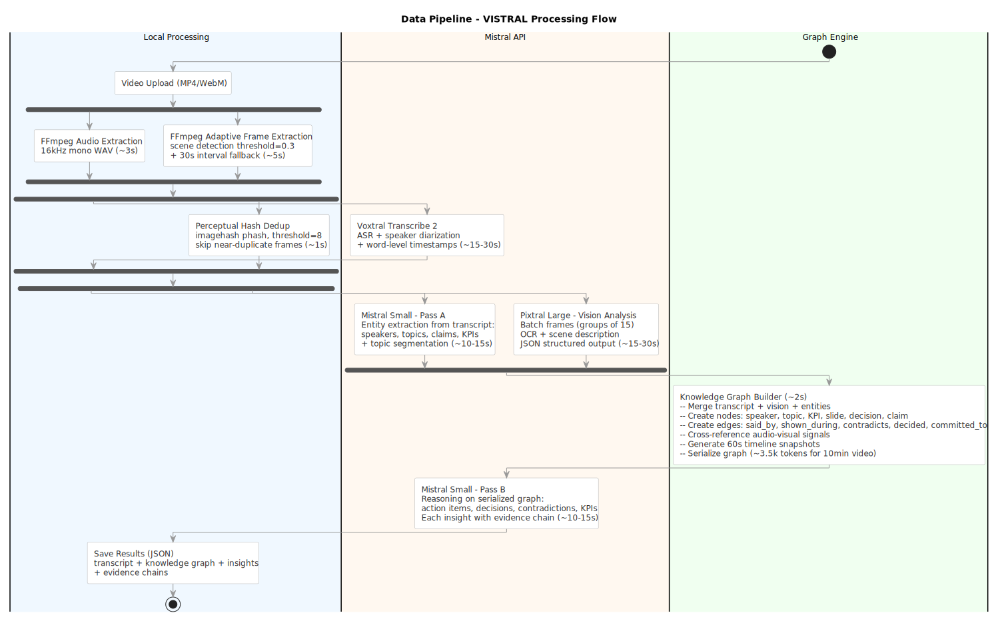
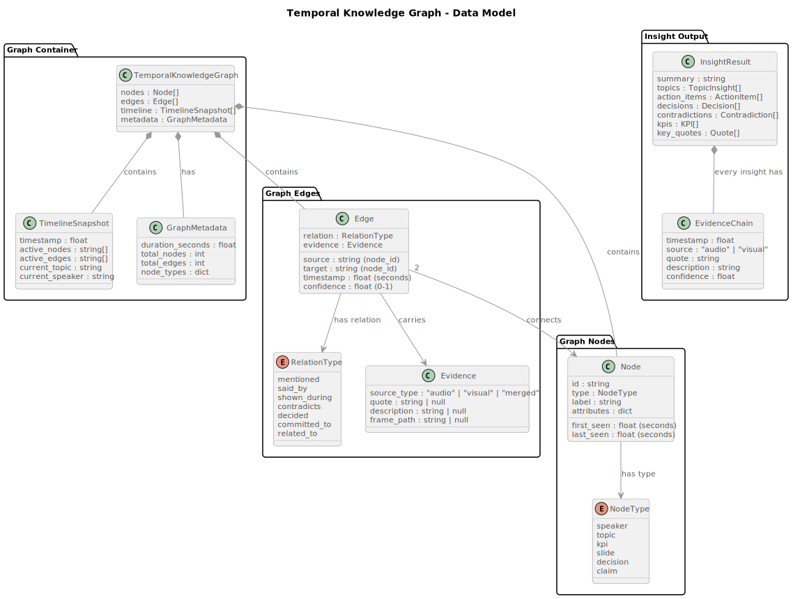
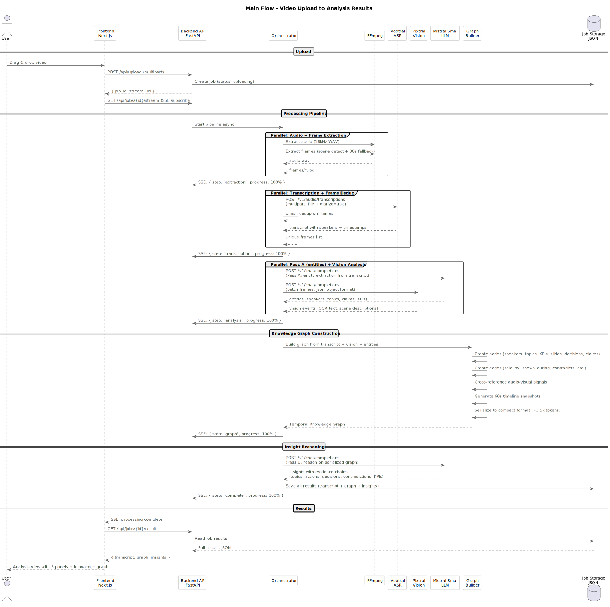
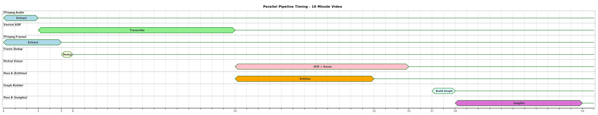
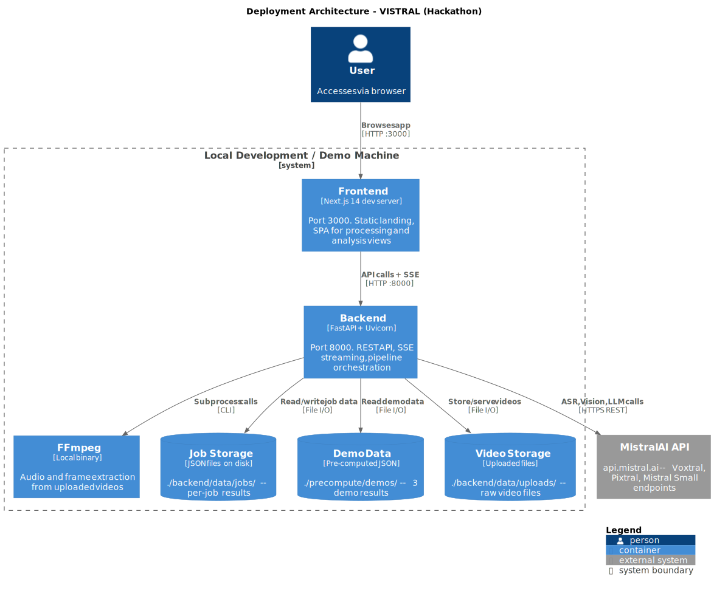

# VISTRAL -- Architecture Documentation

**Video World-State Intelligence by Mistral**

Hackathon Mistral AI Worldwide 2026 | Solo developer | 48h build

---

## Table of Contents

1. [Goals, Non-Goals, and Constraints](#1-goals-non-goals-and-constraints)
2. [System Context](#2-system-context)
3. [Container Architecture](#3-container-architecture)
4. [Component Architecture - Backend](#4-component-architecture---backend)
5. [Component Architecture - Frontend](#5-component-architecture---frontend)
6. [Data Pipeline](#6-data-pipeline)
7. [Temporal Knowledge Graph - Data Model](#7-temporal-knowledge-graph---data-model)
8. [Sequence - Main Flow](#8-sequence---main-flow)
9. [Parallel Pipeline Timing](#9-parallel-pipeline-timing)
10. [Deployment Architecture](#10-deployment-architecture)
11. [Error Handling and Failure Modes](#11-error-handling-and-failure-modes)
12. [Architecture Decision Records](#12-architecture-decision-records)
13. [Cost Analysis](#13-cost-analysis)
14. [Glossary](#14-glossary)

---

## 1. Goals, Non-Goals, and Constraints

### Goals

- Build a web app that extracts **traceable insights** from enterprise videos (meetings, interviews, podcasts)
- Construct a **Temporal Knowledge Graph** from multimodal signals (audio transcription + visual analysis)
- Detect **contradictions** between what speakers say and what slides show
- Provide **evidence chains** for every insight (timestamp + source + quote)
- Demonstrate a **100% Mistral AI stack** (Voxtral, Pixtral, Mistral Small)

### Non-Goals

- Production-grade deployment (no CI/CD, no Docker, no cloud hosting)
- User authentication or multi-tenancy
- Real-time video streaming analysis (only pre-recorded uploads)
- Support for videos longer than 30 minutes (demo-focused)
- Mobile-responsive design (desktop-first for demo)

### Constraints

- **48-hour hackathon** -- every architectural choice optimizes for speed of implementation
- **Single developer** -- no team coordination overhead, but limited parallelism
- **100% Mistral stack** -- no external LLMs (GPT-4, Claude, etc.)
- **Mistral API rate limits** -- must handle gracefully with retries and pre-computed fallbacks
- **Local deployment only** -- runs on a single machine for the demo
- **FFmpeg required** -- must be pre-installed on the demo machine

---

## 2. System Context

**Scope**: The entire VISTRAL system and its relationships with external actors and services.

**Key decisions**:
- VISTRAL acts as an orchestrator between the user and three Mistral API services
- FFmpeg handles all local media processing (audio and frame extraction)
- No external database -- all storage is local JSON files



| Element | Type | Technology | Purpose |
|---------|------|-----------|---------|
| Business User | Person | Browser | Uploads videos, explores analysis results and knowledge graphs |
| VISTRAL | Internal System | Next.js + FastAPI | Core platform: processes video, builds knowledge graph, serves insights |
| Voxtral Transcribe 2 | External System | Mistral API | Speech-to-text with speaker diarization and word-level timestamps |
| Pixtral Large | External System | Mistral API | Visual analysis: OCR on slides, scene description from frames |
| Mistral Small 3 | External System | Mistral API | LLM reasoning: entity extraction and insight generation from graphs |
| FFmpeg | External System | Local binary | Audio extraction (WAV) and adaptive frame extraction (JPG) |

---

## 3. Container Architecture

**Scope**: High-level architecture showing the major containers (applications and data stores) within VISTRAL.

**Key decisions**:
- Frontend and backend are separate applications communicating via REST + SSE
- The processing pipeline is logically separate from the API layer but runs in the same process
- JSON file storage eliminates database setup overhead (see [ADR-005](../adr/005-json-files-over-database.md))



| Container | Technology | Purpose |
|-----------|-----------|---------|
| Frontend SPA | Next.js 14 + TailwindCSS | Landing page, processing animation, 3-panel analysis view, knowledge graph visualization |
| Backend API | Python FastAPI | REST endpoints, SSE streaming, CORS, file serving |
| Processing Pipeline | Python + FFmpeg | Audio/frame extraction, dedup, API orchestration, graph building |
| Job Storage | JSON files on disk | Per-job results: transcript, knowledge graph, insights, pre-computed demos |

### Key Relationships

- Frontend communicates with backend via **REST** (upload, results, demo) and **SSE** (real-time progress)
- Backend triggers pipeline processing **asynchronously** upon video upload
- Pipeline makes **parallel API calls** to Mistral services to minimize latency
- All results are persisted as **JSON files** organized by job ID

---

## 4. Component Architecture - Backend

**Scope**: Internal structure of the Backend API and Processing Pipeline containers.

**Key decisions**:
- Three routers handle distinct API concerns (upload, jobs, demos)
- The orchestrator manages parallelism and SSE event emission
- Pipeline stages are independent modules that can be tested in isolation
- Two-pass LLM architecture separates perception from reasoning (see [ADR-002](../adr/002-two-pass-llm-architecture.md))



| Component | Technology | Purpose |
|-----------|-----------|---------|
| Upload Router | FastAPI Router | Accepts video upload, creates job, triggers pipeline |
| Jobs Router | FastAPI Router | SSE streaming, results endpoint, video serving |
| Demo Router | FastAPI Router | Serves pre-computed demo results |
| Pipeline Orchestrator | Python asyncio | Coordinates pipeline stages, manages parallelism, emits SSE events |
| Audio Extractor | FFmpeg subprocess | Extracts 16kHz mono WAV from video |
| Transcriber | Voxtral API client | ASR with speaker diarization and word timestamps |
| Frame Extractor | FFmpeg subprocess | Adaptive frame extraction (scene detection + interval fallback) |
| Frame Deduplicator | imagehash + PIL | Perceptual hashing to skip near-duplicate frames |
| Vision Analyzer | Pixtral API client | Batch OCR and scene analysis on unique frames |
| Knowledge Graph Builder | Python | Merges all signals into Temporal Knowledge Graph |
| Reasoner | Mistral Small client | Pass A: entity extraction. Pass B: insight extraction |
| Job Storage | JSON files | Per-job results persistence |

### Pipeline Parallelism

The orchestrator exploits three parallelism opportunities:
1. **Audio + Frame extraction** run simultaneously (both use FFmpeg, independent inputs)
2. **Voxtral ASR + Frame dedup** run simultaneously (transcript and frame processing are independent)
3. **Pass A (entities) + Pixtral (vision)** run simultaneously (both consume their own inputs, produce independent outputs)

This reduces total processing time by ~38% for a 10-minute video.

---

## 5. Component Architecture - Frontend

**Scope**: Internal structure of the Frontend SPA container.

**Key decisions**:
- Next.js App Router for file-based routing (3 main pages + dynamic routes)
- Custom hooks (useSSE, useVideoSync) encapsulate complex state synchronization
- Knowledge graph visualization uses react-force-graph-2d for force-directed layout
- All timestamps are clickable (click-to-jump pattern throughout the UI)



| Component | Technology | Purpose |
|-----------|-----------|---------|
| Landing Page | React + TailwindCSS | Hero, drag-and-drop upload, demo selector cards |
| Processing Page | React + SSE | 6-step pipeline visualizer, real-time progress, timeline builder |
| Analysis Page | React | 3-panel layout: video player, timeline, insights panel |
| Knowledge Graph View | react-force-graph-2d | Force-directed graph with color-coded nodes and labeled edges |
| Video Player | HTML5 Video | Playback with active speaker indicator |
| Interactive Timeline | React | Color-coded topic segments, speaker tracks, event markers |
| Insights Panel | React | Tabs: Summary, Topics, Actions, Decisions, Contradictions, Transcript |
| Transcript View | React | Auto-scrolling transcript synced to video playback |
| useSSE Hook | React Hook | Subscribes to backend SSE for real-time pipeline progress |
| useVideoSync Hook | React Hook | Bidirectional sync between video time and all UI components |
| API Client | fetch | HTTP client for all backend communication |

### Design System (Mistral Brand)

| Token | Value | Usage |
|-------|-------|-------|
| Background | `#1a1a1a` | Page background |
| Card | `#242424` | Card/panel backgrounds |
| Border | `#333333` | Borders and dividers |
| Accent | `#FA500F` | Primary action color (orange) |
| Accent Hover | `#E04600` | Hover state for accent |
| Text | `#FFFAEB` | Primary text (warm white) |
| Text Secondary | `#999999` | Secondary/muted text |
| Beige | `#FFF0C3` | Highlight/warm accents |
| Font | Arial, Helvetica, sans-serif | All text |

---

## 6. Data Pipeline

**Scope**: The complete processing flow from video upload to final insights, showing parallelism and data transformations.

**Key decisions**:
- Adaptive frame extraction with perceptual hash dedup reduces Pixtral costs by 70%+ (see [ADR-006](../adr/006-adaptive-frame-extraction-with-dedup.md))
- Pass A starts as soon as transcript is ready, in parallel with Pixtral vision analysis
- Knowledge Graph Builder is a local, fast step (~2s) that merges all multimodal signals
- Pass B reasons on the serialized graph (~3.5k tokens), not the raw transcript (~40k tokens)



### Pipeline Steps Detail

| Step | Input | Output | Duration (10min video) | Runs On |
|------|-------|--------|----------------------|---------|
| Audio Extraction | MP4/WebM video | 16kHz mono WAV | ~3s | Local (FFmpeg) |
| Frame Extraction | MP4/WebM video | JPG frames (scene changes) | ~5s | Local (FFmpeg) |
| Transcription | WAV audio | Diarized transcript with word timestamps | ~15-30s | Voxtral API |
| Frame Dedup | All extracted frames | Unique frames (40-60% reduction) | ~1s | Local (imagehash) |
| Pass A - Entities | Transcript | Speakers, topics, claims, KPIs, topic segments | ~10-15s | Mistral Small API |
| Vision Analysis | Unique frames (batches of 15) | OCR text, scene descriptions, slide content | ~15-30s | Pixtral API |
| Graph Construction | Transcript + entities + vision events | Temporal Knowledge Graph (nodes + edges + snapshots) | ~2s | Local (Python) |
| Pass B - Insights | Serialized graph (~3.5k tokens) | Insights with evidence chains | ~10-15s | Mistral Small API |

---

## 7. Temporal Knowledge Graph - Data Model

**Scope**: The core data structure that differentiates VISTRAL from flat transcript analysis tools.

**Key decisions**:
- Graph-based representation validated by TSG research: 65% accuracy with 3.47k tokens vs 62.5% with 40.39k tokens for flat event logs (see [ADR-001](../adr/001-temporal-knowledge-graph-over-flat-transcript.md))
- Six node types cover the entities found in enterprise videos
- Seven relation types capture temporal and semantic relationships
- Every edge carries an evidence object for traceability
- Contradiction detection is native: conflicting edges between claim nodes



### Node Types

| Type | Example | Attributes |
|------|---------|-----------|
| speaker | "Alice Chen" | role, speaking_time_pct |
| topic | "Q3 Budget Review" | key_points, duration |
| kpi | "Revenue +18%" | value, unit, trend |
| slide | "Slide: Q3 Budget Overview" | ocr_text, frame_path |
| decision | "Increase marketing budget" | priority, assignees |
| claim | "Revenue grew 18%" | source_type, confidence |

### Relation Types

| Relation | Example | Typical Source |
|----------|---------|---------------|
| mentioned | speaker -> kpi | Audio (transcript) |
| said_by | claim -> speaker | Audio (transcript) |
| shown_during | topic -> slide | Visual (Pixtral) |
| contradicts | audio_claim -> visual_claim | Cross-modal (audio vs visual) |
| decided | speaker -> decision | Audio (transcript) |
| committed_to | speaker -> action_item | Audio (transcript) |
| related_to | topic -> topic | Reasoning (Mistral Small) |

### Graph Serialization for Pass B

The graph is serialized to a compact text format (~3.5k tokens for a 10-minute video):
```
NODES:
[S0] Alice Chen (PM, 42% speaking time) [0.0-580.0s]
[S1] Bob Smith (Engineer, 35% speaking time) [5.0-560.0s]
[T0] Q3 Budget Review [30.0-180.0s]
[K0] Revenue +18% (audio) / +8% (slide) [43.0-45.2s]

EDGES:
S0 --mentioned--> K0 @45.2s (conf:0.92) "Revenue grew 18% this quarter"
K0 --contradicts--> K0_slide @43.0s (conf:0.88) slide shows +8% YoY
S0 --decided--> D0 @245.0s "Increase marketing budget by 15%"
```

This compact representation is what Mistral Small receives in Pass B -- 91% fewer tokens than sending the full transcript.

---

## 8. Sequence - Main Flow

**Scope**: The complete lifecycle of a video from upload to analysis results display.

**Key decisions**:
- SSE subscription happens immediately after upload, before processing starts
- Pipeline stages emit progress events at each step boundary
- Results are fetched via REST after SSE signals completion
- The frontend navigates from processing to analysis page automatically



### Key Interactions

1. **Upload**: User drops video -> Frontend POSTs to backend -> Backend returns job_id + stream_url
2. **SSE Subscribe**: Frontend connects to SSE endpoint immediately
3. **Pipeline**: Backend runs stages in parallel where possible, emitting progress at each step
4. **Completion**: SSE signals done -> Frontend fetches full results via REST
5. **Analysis**: Frontend renders 3-panel view with video player, timeline, and insights

---

## 9. Parallel Pipeline Timing

**Scope**: Timing diagram showing how pipeline stages overlap for a 10-minute video.

**Key decisions**:
- Three parallelism windows save ~38% total processing time
- Critical path: Audio Extract -> ASR -> Pass A -> Graph Build -> Pass B (~50s total)
- Pixtral vision runs "for free" alongside ASR and Pass A (overlapped)



### Timing Breakdown (10-minute video, estimated)

| Time (s) | Active Stages |
|-----------|--------------|
| 0-3 | Audio extraction + Frame extraction (parallel) |
| 3-6 | Voxtral ASR + Frame dedup (parallel) |
| 6-20 | Voxtral ASR continues |
| 20-35 | Pass A entities + Pixtral vision (parallel) |
| 37-39 | Knowledge Graph construction |
| 39-50 | Pass B insight reasoning |
| **Total** | **~50 seconds** |

---

## 10. Deployment Architecture

**Scope**: How VISTRAL is deployed for the hackathon demo.

**Key decisions**:
- Local deployment only (no cloud, no Docker)
- Frontend dev server on port 3000, backend on port 8000
- Videos stored as files (no object storage)
- Pre-computed demos allow instant fallback if live processing fails



| Component | Port/Path | Notes |
|-----------|----------|-------|
| Next.js dev server | :3000 | `npm run dev` |
| FastAPI + Uvicorn | :8000 | `uvicorn main:app --reload` |
| FFmpeg | System PATH | `/opt/homebrew/bin/ffmpeg` |
| Job results | `backend/data/jobs/` | One JSON file per job |
| Demo data | `precompute/demos/` | Pre-computed results for 3 demo videos |
| Uploaded videos | `backend/data/uploads/` | Raw video files |

---

## 11. Error Handling and Failure Modes

### Failure Cascade

| Component Failure | Impact | Recovery Strategy |
|-------------------|--------|-------------------|
| Mistral API rate limit | Pipeline stalled at ASR/Vision/LLM step | Exponential backoff retry (3 attempts, 2s/4s/8s delay) |
| Mistral API down | No processing possible | Serve pre-computed demos, show "API unavailable" banner |
| Voxtral diarization poor | Speakers mislabeled | Fallback to "Speaker A/B/C", let Pass A attempt resolution |
| Pixtral returns invalid JSON | Vision analysis missing | `response_format: json_object` + try/except, continue with audio-only insights |
| FFmpeg not installed | No audio/frame extraction | Fail fast at startup with clear error message |
| Video format unsupported | Upload rejected | Validate MIME type before processing, show supported formats |
| Processing timeout (> 5 min) | Job stuck | Cancel pipeline, return partial results if available |
| Job storage write failure | Results lost | Log error, attempt retry, show error to user |

### Fallback Strategy

1. **Live processing fails** -> Switch to pre-computed demo ("Let me show you our pre-analyzed meeting")
2. **Vision fails** -> Continue with audio-only analysis (transcript + Pass A + Pass B without visual signals)
3. **Pass A quality low** -> Escalate to Mistral Large for Pass A (cost increase acceptable for demo)
4. **SSE connection drops** -> Frontend auto-reconnects and fetches current state via REST

---

## 12. Architecture Decision Records

| ADR | Decision | Status |
|-----|----------|--------|
| [ADR-001](../adr/001-temporal-knowledge-graph-over-flat-transcript.md) | Temporal Knowledge Graph over flat transcript | Accepted |
| [ADR-002](../adr/002-two-pass-llm-architecture.md) | Two-pass LLM architecture (perception then reasoning) | Accepted |
| [ADR-003](../adr/003-mistral-small-over-large.md) | Mistral Small 3 as primary LLM over Large | Accepted |
| [ADR-004](../adr/004-sse-for-realtime-progress.md) | Server-Sent Events for real-time progress | Accepted |
| [ADR-005](../adr/005-json-files-over-database.md) | JSON file storage over database | Accepted |
| [ADR-006](../adr/006-adaptive-frame-extraction-with-dedup.md) | Adaptive frame extraction with perceptual hash dedup | Accepted |

---

## 13. Cost Analysis

### Per-Video Cost (10-minute video)

| Service | Calculation | Cost |
|---------|------------|------|
| Voxtral Transcribe 2 | 10 min x $0.003/min | $0.03 |
| Pixtral Large | ~10 frames x ~2K tokens each | ~$0.05 |
| Mistral Small (Pass A + B) | ~20K tokens total | ~$0.005 |
| **Total** | | **~$0.085** |

### Comparison Without Optimizations

| Approach | Cost per 10min video | Token usage |
|----------|---------------------|-------------|
| VISTRAL (optimized) | ~$0.085 | ~25K tokens |
| Mistral Large, no dedup | ~$0.50+ | ~150K tokens |
| Flat transcript to Large | ~$0.30 | ~80K tokens |

### Optimization Impact

| Optimization | Savings |
|-------------|---------|
| Mistral Small over Large | -90% LLM cost |
| Perceptual hash dedup | -40-60% frames sent to Pixtral |
| Adaptive frame extraction | -50% frames vs fixed interval |
| Graph serialization | -91% tokens for Pass B input |
| 1024px downscale | -30% vision tokens |

---

## 14. Glossary

| Term | Definition |
|------|-----------|
| **Temporal Knowledge Graph (TKG)** | A graph data structure where nodes represent entities (speakers, topics, KPIs) and edges represent temporal relationships (said_by, contradicts). Core data structure of VISTRAL. |
| **Pass A** | First LLM pass: entity extraction and topic segmentation from transcript. Perception-focused. |
| **Pass B** | Second LLM pass: insight extraction from serialized knowledge graph. Reasoning-focused. |
| **Evidence Chain** | A list of timestamped, source-attributed quotes or descriptions that support an insight. Enables traceability. |
| **Perceptual Hash (phash)** | A hash function that produces similar outputs for visually similar images. Used to deduplicate near-identical video frames. |
| **Diarization** | The process of identifying which speaker is talking at each moment in an audio recording. Provided by Voxtral. |
| **Scene Detection** | FFmpeg's ability to detect visual scene changes in video. Used for adaptive frame extraction. |
| **U-shaped Prompt** | A prompt structure with instructions at the beginning and end, data in the middle. Proven to improve LLM attention to both task and format. |
| **SSE (Server-Sent Events)** | A web standard for one-directional server-to-client streaming over HTTP. Used for real-time pipeline progress. |
| **Voxtral** | Mistral's ASR (Automatic Speech Recognition) model with speaker diarization support. |
| **Pixtral** | Mistral's vision model capable of OCR and scene understanding from images. |
| **TSG (Temporal Scene Graph)** | Academic concept from "Semantic Event Graphs for Long-Form VideoQA" (2025). Validates VISTRAL's graph approach. |
| **Force-directed Graph** | A graph visualization algorithm where nodes repel each other and edges act as springs, producing organic layouts. |
